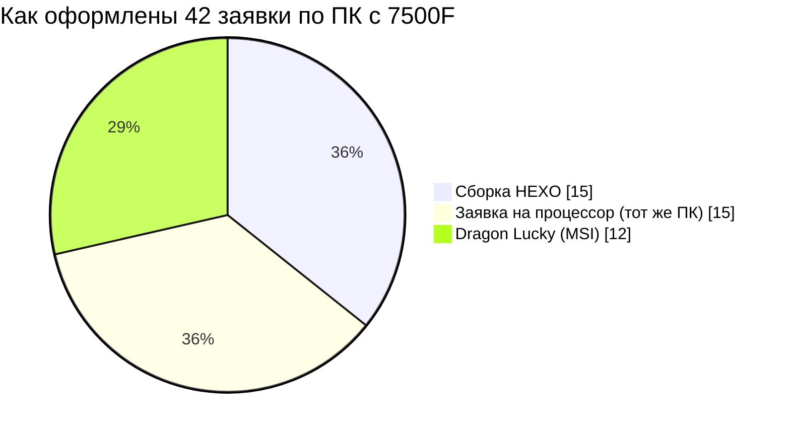
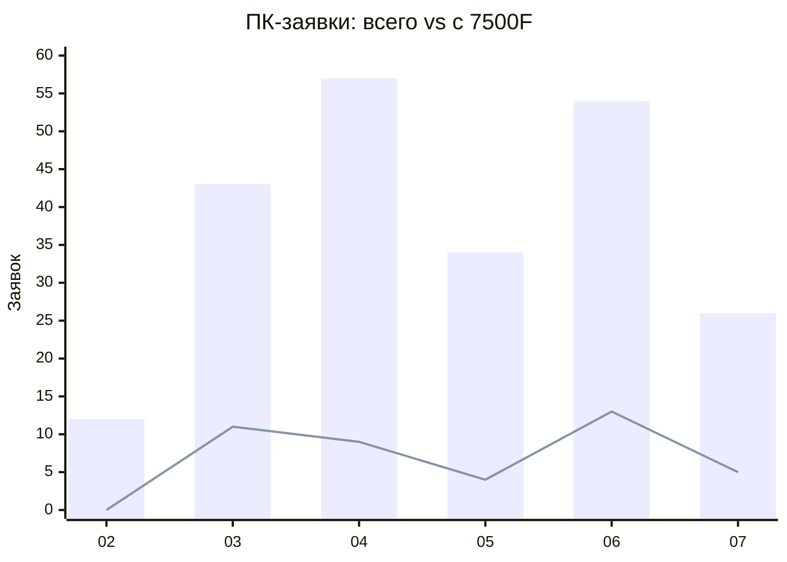
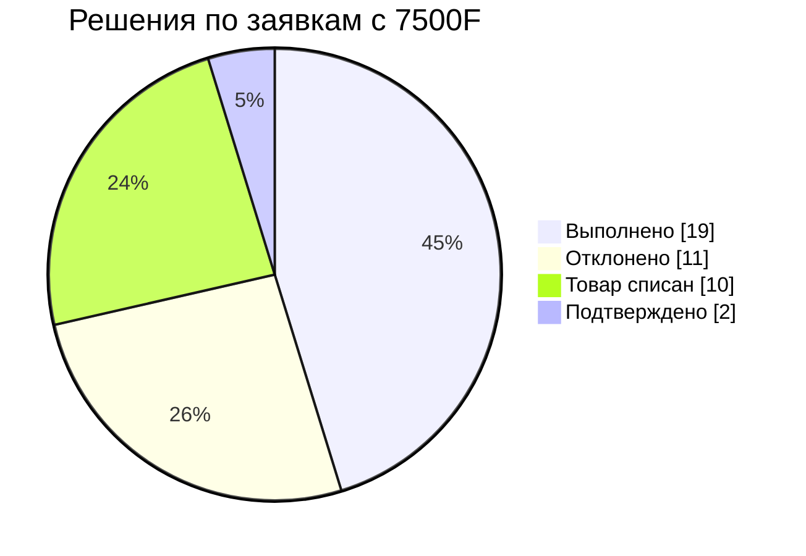

# Отчёт: заявки по ПК с Ryzen 5 7500F (HEXO / Dragon Lucky)

## 0. Списки СЗ (для копипасты)

### 42 СЗ по ПК с 7500F

Одной строкой:

```
151039, 151055, 151104, 151239, 151280, 151771, 151911, 152530, 152544, 152717, 152792, 152836, 153045, 153494, 153882, 153925, 154130, 154368, 154535, 154589, 154799, 155015, 155473, 156106, 156929, 157393, 158329, 158816, 158849, 158859, 158890, 158923, 158962, 159002, 159085, 159111, 159122, 159426, 159794, 159915, 160922, 160990
```

<details>
<summary>Столбиком (для вставки в Excel)</summary>

```
151039
151055
151104
151239
151280
151771
151911
152530
152544
152717
152792
152836
153045
153494
153882
153925
154130
154368
154535
154589
154799
155015
155473
156106
156929
157393
158329
158816
158849
158859
158890
158923
158962
159002
159085
159111
159122
159426
159794
159915
160922
160990
```

</details>

| СЗ | Принята | Форма СЗ | Товар | Класс дефекта | Решение |
|---|---|---|---|---|---|
| 151039 | 2026-03-03 | CPU-СЗ | Ryzen 5 7500F (tray) | POST | Товар списан |
| 151055 | 2026-03-03 | CPU-СЗ | Ryzen 5 7500F (tray) | прочее | Товар списан |
| 151104 | 2026-03-11 | HEXO | HEXO Gaming Mainstream Pro Black HGMP-7500FN5060TI-32S1TBK | POST | Отклонено |
| 151239 | 2026-03-06 | HEXO | HEXO Gaming TwinFront Pro+ Black HGP-B850TF7500FN5060TI-D532S1TBK | прочее | Подтверждено |
| 151280 | 2026-03-20 | Dragon Lucky | Dragon Lucky Gold (RTX 5060 + R5 7500F) Black | прочее | Отклонено |
| 151771 | 2026-03-14 | Dragon Lucky | Dragon Lucky Snow (RTX 5060TI + R5 7500F-WH) White | POST | Отклонено |
| 151911 | 2026-03-15 | HEXO | HEXO Gaming Mainstream Pro Black HGMP-7500FN5060TI-32S1TBK | POST | Выполнено |
| 152530 | 2026-05-18 | Dragon Lucky | Dragon Lucky Shadow (RTX5060TI + R5 7500F) Black | прочее | Подтверждено |
| 152544 | 2026-03-25 | Dragon Lucky | Dragon Lucky Gold (RTX 5060TI + R5 7500F) Black | вырубон | Выполнено |
| 152717 | 2026-03-28 | Dragon Lucky | Dragon Lucky Gold (RTX 5060TI + R5 7500F) Black | прочее | Выполнено |
| 152792 | 2026-03-31 | HEXO | HEXO Gaming Mainstream Pro Black HGMP-7500FN5060TI-32S1TBK | прочее | Отклонено |
| 152836 | 2026-03-29 | Dragon Lucky | Dragon Lucky Gold (RTX 5060TI + R5 7500F) Black | вырубон | Выполнено |
| 153045 | 2026-04-10 | HEXO | HEXO Gaming TwinFront Pro Black HGP-B850TF7500FN507-D532S1TBK | вырубон | Отклонено |
| 153494 | 2026-04-07 | CPU-СЗ | Ryzen 5 7500F (tray) | POST | Выполнено |
| 153882 | 2026-04-21 | HEXO | HEXO Gaming Mainstream Pro White HGMP-7500FN5060TI8G-32S1TWH | вырубон | Отклонено |
| 153925 | 2026-04-15 | HEXO | HEXO Gaming Mainstream Pro Black HGMP-7500FN5060-32S1TBK | POST | Отклонено |
| 154130 | 2026-04-17 | CPU-СЗ | Ryzen 5 7500F (tray) | вырубон | Выполнено |
| 154368 | 2026-04-21 | CPU-СЗ | Ryzen 5 7500F (tray) | POST | Товар списан |
| 154535 | 2026-04-23 | CPU-СЗ | Ryzen 5 7500F (tray) | POST | Товар списан |
| 154589 | 2026-04-24 | HEXO | HEXO Gaming Mainstream Pro Black HGMP-7500FN5060-32S1TBK | прочее | Выполнено |
| 154799 | 2026-04-28 | Dragon Lucky | Dragon Lucky Gold (RTX 5060TI + R5 7500F) Black | вырубон | Выполнено |
| 155015 | 2026-05-04 | Dragon Lucky | Dragon Lucky Gold (RTX 5060 + R5 7500F) Black | прочее | Выполнено |
| 155473 | 2026-05-13 | HEXO | HEXO Gaming Mainstream Pro Black HGMP-7500FN5060TI-32S1TBK | вырубон | Выполнено |
| 156106 | 2026-05-29 | HEXO | HEXO Gaming Mainstream Pro White HGMP-7500FN5060TI-32S1TWH | вырубон | Отклонено |
| 156929 | 2026-06-05 | HEXO | HEXO Gaming Mainstream Pro Black HGMP-7500FN5060TI-32S1TBK | прочее | Выполнено |
| 157393 | 2026-06-04 | CPU-СЗ | Ryzen 5 7500F (tray) | прочее | Товар списан |
| 158329 | 2026-06-16 | Dragon Lucky | Dragon Lucky Gold (RTX 5060 + R5 7500F) Black | POST | Выполнено |
| 158816 | 2026-06-22 | Dragon Lucky | Dragon Lucky Gold (RTX 5060TI + R5 7500F) Black | вырубон | Выполнено |
| 158849 | 2026-06-23 | CPU-СЗ | Ryzen 5 7500F (tray) | POST | Выполнено |
| 158859 | 2026-06-25 | HEXO | HEXO Gaming Mainstream Pro White HGMP-7500FN5060TI-32S1TWH | вырубон | Отклонено |
| 158890 | 2026-06-26 | HEXO | HEXO Gaming Mainstream Pro Black HGMP-7500FN5070-32S1TBK | вырубон | Отклонено |
| 158923 | 2026-06-24 | CPU-СЗ | Ryzen 5 7500F (tray) | POST | Товар списан |
| 158962 | 2026-06-27 | HEXO | HEXO Gaming Mainstream Pro Black HGMP-7500FN5060-32S1TBK | вырубон | Выполнено |
| 159002 | 2026-06-25 | CPU-СЗ | Ryzen 5 7500F (tray) | вырубон | Товар списан |
| 159085 | 2026-06-26 | CPU-СЗ | Ryzen 5 7500F (tray) | прочее | Выполнено |
| 159111 | 2026-06-26 | CPU-СЗ | Ryzen 5 7500F (tray) | вырубон | Товар списан |
| 159122 | 2026-06-26 | CPU-СЗ | Ryzen 5 7500F (tray) | прочее | Выполнено |
| 159426 | 2026-07-07 | Dragon Lucky | Dragon Lucky Gold (RTX 5060 + R5 7500F) Black | вырубон | Выполнено |
| 159794 | 2026-07-07 | HEXO | HEXO Gaming RTX4070S Pro+ White HGB-7500FN4070S-D532S1TWH | POST | Отклонено |
| 159915 | 2026-07-08 | CPU-СЗ | Ryzen 5 7500F (tray) | POST | Товар списан |
| 160922 | 2026-07-23 | Dragon Lucky | Dragon Lucky Gold (RTX 5060 + R5 7500F) Black | прочее | Выполнено |
| 160990 | 2026-07-24 | CPU-СЗ | Ryzen 5 7500F (tray) | вырубон | Товар списан |

### Все 230 СЗ по компьютерам (база отчёта)

<details>
<summary>Одной строкой — 230 номеров</summary>

```
148107, 148840, 149025, 149512, 149527, 149673, 150049, 150184, 150525, 150576, 150580, 150732, 150951, 150967, 150976, 151039, 151042, 151055, 151092, 151104, 151162, 151194, 151239, 151258, 151259, 151271, 151280, 151527, 151532, 151548, 151557, 151617, 151655, 151685, 151761, 151769, 151771, 151780, 151793, 151827, 151880, 151911, 151933, 152091, 152093, 152137, 152272, 152463, 152475, 152503, 152530, 152544, 152560, 152572, 152606, 152717, 152792, 152836, 152910, 152922, 152927, 152961, 153042, 153045, 153051, 153062, 153128, 153179, 153237, 153361, 153369, 153370, 153374, 153392, 153446, 153466, 153494, 153526, 153532, 153549, 153563, 153565, 153624, 153659, 153668, 153711, 153738, 153746, 153882, 153925, 153967, 153975, 153993, 154003, 154004, 154016, 154086, 154102, 154113, 154130, 154170, 154179, 154288, 154306, 154361, 154368, 154372, 154417, 154535, 154589, 154668, 154743, 154799, 154800, 154897, 154899, 155013, 155015, 155017, 155032, 155033, 155049, 155055, 155338, 155365, 155409, 155449, 155451, 155468, 155473, 155488, 155494, 155519, 155829, 155857, 156002, 156021, 156041, 156047, 156074, 156106, 156200, 156216, 156365, 156559, 156768, 156787, 156928, 156929, 157104, 157181, 157302, 157312, 157368, 157371, 157392, 157393, 157402, 157447, 157513, 157655, 157670, 157678, 157780, 157891, 157994, 158035, 158075, 158253, 158283, 158328, 158329, 158337, 158421, 158468, 158477, 158563, 158566, 158568, 158766, 158793, 158795, 158816, 158849, 158851, 158859, 158890, 158923, 158962, 158964, 158973, 158987, 159002, 159085, 159096, 159097, 159111, 159122, 159198, 159276, 159290, 159384, 159426, 159527, 159530, 159558, 159645, 159676, 159794, 159826, 159873, 159915, 159974, 159985, 160031, 160060, 160145, 160174, 160701, 160706, 160922, 160990, 161100, 161228, 161432, 161434, 161658, 161679, 161738, 161883
```

</details>

<details>
<summary>Разбивка по типу заявки</summary>

**Готовые сборки HEXO / Dragon Lucky — 61:**

```
150732, 150951, 151092, 151104, 151239, 151259, 151280, 151548, 151771, 151880, 151911, 152137, 152530, 152544, 152717, 152792, 152836, 153045, 153369, 153882, 153925, 154170, 154288, 154361, 154417, 154589, 154799, 155015, 155017, 155033, 155409, 155473, 155519, 156041, 156106, 156216, 156365, 156768, 156928, 156929, 157104, 157181, 157513, 157655, 157994, 158253, 158329, 158421, 158793, 158816, 158859, 158890, 158962, 159096, 159198, 159290, 159426, 159645, 159794, 160174, 160922
```

**Сборка/конфигурация (`Збірок`/`Конфігурацій` ≥ 1) — 153:**

```
148107, 148840, 149025, 149512, 149527, 149673, 150049, 150184, 150525, 150576, 150580, 150967, 150976, 151039, 151042, 151055, 151162, 151194, 151258, 151271, 151527, 151532, 151557, 151617, 151655, 151685, 151761, 151769, 151780, 151793, 151827, 151933, 152091, 152093, 152272, 152463, 152475, 152503, 152560, 152572, 152606, 152910, 152922, 152927, 152961, 153042, 153062, 153128, 153179, 153237, 153361, 153370, 153374, 153392, 153446, 153466, 153526, 153532, 153549, 153563, 153624, 153659, 153668, 153711, 153738, 153975, 153993, 154003, 154004, 154016, 154086, 154102, 154113, 154179, 154368, 154372, 154535, 154668, 154743, 154800, 154897, 154899, 155013, 155032, 155049, 155055, 155338, 155365, 155449, 155451, 155468, 155488, 155494, 155857, 156002, 156021, 156047, 156074, 156200, 156559, 156787, 157302, 157312, 157368, 157371, 157392, 157393, 157402, 157447, 157670, 157678, 157780, 157891, 158035, 158075, 158283, 158328, 158337, 158477, 158563, 158566, 158568, 158766, 158795, 158923, 158964, 158973, 159002, 159111, 159276, 159384, 159527, 159530, 159558, 159676, 159826, 159873, 159974, 159985, 160031, 160060, 160145, 160701, 160706, 160990, 161100, 161228, 161432, 161434, 161658, 161679, 161738, 161883
```

**Оформлены на процессор — 16:**

```
153051, 153494, 153565, 153746, 153967, 154130, 154306, 155829, 158468, 158849, 158851, 158987, 159085, 159097, 159122, 159915
```

</details>

---

Источник: `123.xlsx` (выгрузка заявок, колонка **N «Товар»**), 462 строки → 410 уникальных заявок,
период **2026-01 … 2026-08** (наполнение с марта), диагносты — Василевський Олександр (268) и Тимченко Назар (142).

**База подсчёта — заявки по компьютерам, а не по всем товарам.** Заявка считается «компьютерной», если
её товар — готовая сборка (HEXO Gaming/Office/Home, Dragon Lucky Powered_by MSI), либо в заявке проставлены
`Збірок`/`Конфігурацій` ≥ 1, либо товар оформлен на процессор — **заявки «чисто с процессором» это те же
компы**, просто в СЗ вписали вынутый камень. Отдельные компоненты без привязки к машине (память, БП, корпуса,
камеры, накопители) из счёта исключены.

| | Заявок |
|---|---:|
| Всего в выгрузке | 410 |
| **Заявки по ПК (база отчёта)** | **230** |
| Отдельные компоненты/аксессуары (исключены) | 180 |

> Оговорка: одна строка = один товар; у 52 заявок несколько товарных строк. Счёт по уникальному номеру СЗ:
> заявка «7500F», если 7500F есть хотя бы в одном её товаре.

---

## 1. Главные цифры

| Срез | Заявок | Доля от 230 ПК |
|---|---:|---:|
| **ПК с 7500F** | **42** | **18.3 %** |
| Готовые сборки HEXO (все CPU) | 41 | 17.8 % |
| Dragon Lucky Powered_by MSI (все CPU) | 20 | 8.7 % |
| — из них HEXO **с 7500F** | 15 | 6.5 % |
| — из них Dragon Lucky **с 7500F** | 12 | 5.2 % |
| — заявка оформлена на сам процессор 7500F | 15 | 6.5 % |

**Каждый пятый компьютер в сервисе — на 7500F.** Среди 97 ПК-заявок, где модель CPU видна в названии
товара, **7500F — 42, то есть 43 %**, следующий 7700 — 18.

```
Модель CPU в ПК-заявках (шт., где модель видна в товаре)
7500F   ████████████████████████████████████████████  42
7700    ███████████████████                           18
5600    ███████████                                   11
9800X3D █████                                          5
5500    █████                                          5
7800X3D ████                                           4
5650G   ████                                           4
прочие  ███████                                        8
```



---

## 2. Симптоматика: 7500F выбивается по вырубонам

Классификация по тексту дефекта, внутри пула из 230 ПК-заявок.

| Класс дефекта | ПК-заявок | С 7500F | Доля 7500F |
|---|---:|---:|---:|
| Вырубоны / ребуты / вылеты | 52 | **16** | **31 %** |
| Не стартует / не проходит POST | 51 | 13 | 25 % |
| Зависания | 2 | 0 | — |
| Прочее (комплектация, упаковка, SSD, БП, шум…) | 125 | 13 | 10 % |

Базовая доля 7500F среди ПК — **18 %**, а в классе «вырубоны/ребуты» — **31 %**, то есть **в 1.7 раза выше
ожидаемого**; в «прочем» наоборот вдвое ниже (10 %). Перекос ровно в ту сторону, что и гипотеза из kb:
IMC 7500F + заводской EXPO/XMP 6000.

```
Доля 7500F внутри класса дефекта (база 18%)
вырубоны/ребуты  ███████████████████████████████ 31%
не стартует/POST █████████████████████████       25%
база по ПК       ██████████████████               18%
прочее           ██████████                       10%
```

Когда СЗ пишут на машину целиком — почерк «вырубоны» (12 из 27). Когда камень уже вынули и завели СЗ на него —
формулировка съезжает в «не проходит пост коды» (7 из 15), потому что тестируют голый процессор на стенде,
а не машину с её памятью и профилем.

---

## 3. Прямые упоминания EXPO / XMP в дефекте

Всего **9 заявок** (по всей выгрузке, включая компонентные), где прямо написано про профиль памяти:

| СЗ | Товар | Дефект | Решение |
|---|---|---|---|
| 160990 | **Ryzen 5 7500F** (ПК) | «Перезавантажується в OCCT power при включенному EXPO 5600» | Товар списан |
| 159645 | HEXO TwinFront Pro (7700) | «не работает expo 1, 6000 герц; на 5600 запускается, ошибка post» | Выполнено |
| 157768 | AsRock B850M-X WIFI R2.0 | «(повторный ремонт) не працює двоканал при XMP/EXPO» | Отклонено |
| 152093 | сборка (корпус 1stPlayer) | «не запускається при включеному AMD EXPO; зникає зображення через 30 мин–часы» | Выполнено |
| 153526 | сборка (корпус PCCooler C3) | «активував EXPO профіль 1 — комп'ютер перестав запускатись» (нужен для FaceIT) | Выполнено |
| 151267 | Kingston FURY Beast **DDR5-6000** 2×16 | «Висить на RAM при XMP 6000» | Товар списан |
| 153062 | Patriot Viper Venom **DDR5-6000** 2×16 | «Не працює XMP 6000MT/s» | Товар списан |
| 151042 | Kingston FURY Renegade **DDR5-6400** 2×32 | «Висить на пост RAM при XMP» | Товар списан |
| 158135 | Asus PRIME B760-PLUS (Intel) | «Не проходить пост код в двоканалі з XMP» | Отклонено |

**5 из 9 закончились списанием памяти/платы**, хотя дефект по сути — «комплект не держит свой заводской профиль».
Ровно системный вывод из CLAUDE.md: занижение профиля до 5600 сняло бы часть списаний.

---

## 4. Динамика по месяцам (только ПК-заявки)

| Месяц | ПК-заявок | С 7500F | Доля |
|---|---:|---:|---:|
| 2026-02 | 12 | 0 | 0 % |
| 2026-03 | 43 | 11 | 26 % |
| 2026-04 | 57 | 9 | 16 % |
| 2026-05 | 34 | 4 | 12 % |
| 2026-06 | 54 | 13 | 24 % |
| 2026-07 | 26 | 5 | 19 % |
| 2026-08 (неполный) | 4 | 0 | 0 % |



Поток ровный — **4–13 заявок в месяц, 12–26 % всех ПК**, без затухания. Это постоянный фон платформы,
а не одна бракованная партия.

---

## 5. Чем закончились заявки с 7500F

| Решение | ПК-заявок (230) | 7500F (42) |
|---|---:|---:|
| Выполнено | 109 (47 %) | 19 (45 %) |
| Товар списан | 87 (38 %) | 10 (24 %) |
| Отклонено | 23 (10 %) | 11 (26 %) |
| Подтверждено | 8 | 2 |



Разрез по форме заявки — самое показательное:

| | Выполнено | Отклонено | Товар списан | Подтверждено |
|---|---:|---:|---:|---:|
| Оформлена на процессор (15) | 5 | 0 | **10** | 0 |
| Сборка HEXO (15) | 5 | **9** | 0 | 1 |
| Dragon Lucky (12) | 9 | 2 | 0 | 1 |

- **Дошло до процессора — камень списывают** (10 из 15). То есть машину разобрали, дефект списали на CPU.
- **Сборки HEXO массово отклоняют** — 9 из 15 (60 % против 10 % в среднем по ПК): на стенде не воспроизвели,
  машина уехала к клиенту с тем же вырубоном.
- Dragon Lucky в основном ремонтируют (9 из 12) — там чаще железные поломки (SSD, кулер, индикатор DRAM).

Итого по 7500F: **19 отремонтировали, 10 списали процессор, 11 вернули клиенту без диагноза**.

---

## 6. Выводы

1. **7500F — 42 из 230 ПК-заявок (18.3 %), каждый пятый компьютер в сервисе**; среди заявок с видимой
   моделью CPU его доля 43 % (7700 на втором месте — 18 заявок).
2. **В классе «вырубоны/ребуты» доля 7500F — 31 % при базе 18 %.** Перекос ×1.7 подтверждает гипотезу
   «7500F + заводской DDR5-6000» на массиве, а не на трёх живых кейсах.
3. **Форма заявки маскирует один и тот же дефект:** машина целиком → «вырубоны», вынутый камень → «не проходит
   POST». Считать это одной популяцией, иначе статистика по CPU-заявкам врёт.
4. **60 % заявок по сборкам HEXO с 7500F отклонены** (не воспроизвели). Прямой кандидат на процедуру:
   любой вырубон на 7500F гонять OCCT Power **на стоке и на EXPO-профиле** — разница между прогонами и есть вердикт.
5. **9 заявок прямо про EXPO/XMP**, 5 из них → списание памяти/платы за то, что комплект не держит заводской профиль.

**Что напрашивается:** зашивать в сборки HEXO/Dragon Lucky на 7500F профиль памяти **5600 вместо заводских 6000**
и фиксировать это в тест-плане приёмки; в СЗ, заведённых на процессор, всегда сохранять исходный симптом машины,
иначе теряется связь «вырубон → память».
